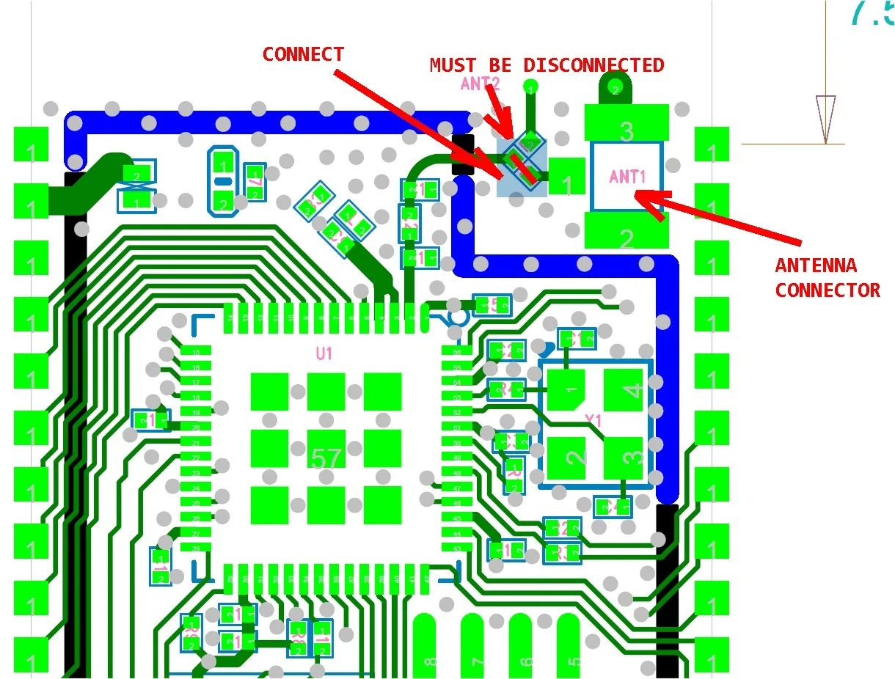
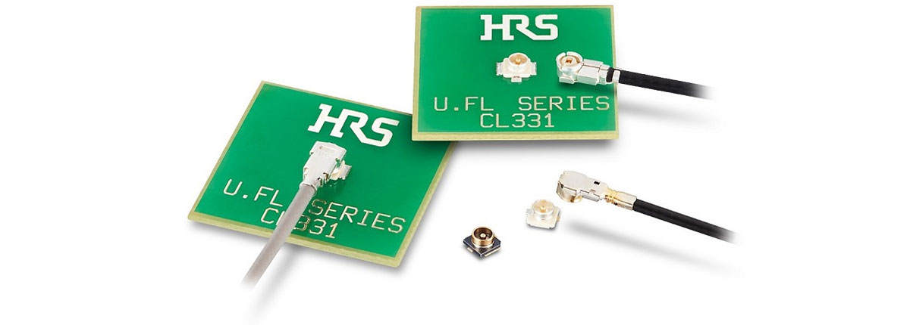
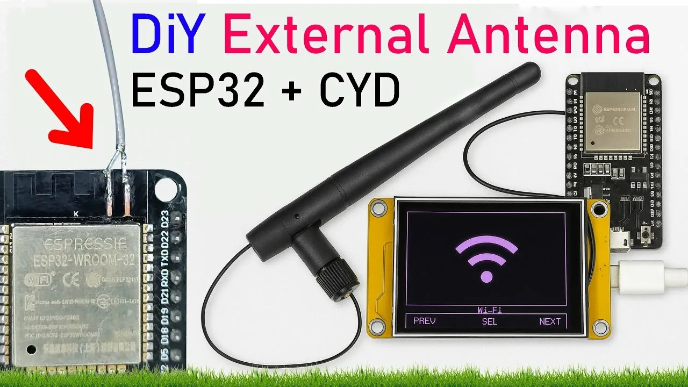

## [Как усилить сигнал WiFi для ESP32](#) 

Для усиления Wi-Fi сигнала у ESP32 есть несколько проверенных методов — от простой модификации встроенной антенны до подключения полноценной внешней.

#### [Модификация встроенной антенны](#)

Этот способ хорошо подходит для компактных модулей вроде ESP32-C3 SuperMini, где встроенная SMD-антенна из-за малых размеров и керамической конструкции работает неэффективно.

Суть модификации: добавить отрезок посеребрённой проволоки длиной около 31 мм, выполненный в виде четвертьволновой антенны ***(λ/4)***.

***[Конструкция:](#)***

Нижняя часть проволоки (примерно 16 мм) сгибается в горизонтальную петлю диаметром около 8 мм.

Оставшийся отрезок (15 мм) направляется вертикально вверх.

Петлю можно обернуть вокруг стержня сверла диаметром 5 мм, а затем расширить концы, чтобы они касались контактов оригинальной SMD-антенны.

Как это работает: новую проволочную антенну припаивают непосредственно к обоим концам оригинальной SMD-антенны на модуле (к контакту 50 Ом и к другому «горячему» концу). Это фактически «обходит» встроенную антенну на печатной плате, и основную роль начинает играть проволочный элемент. Старая антенна при этом остаётся на месте, но становится электрически неэффективной.

***[Важные нюансы:](#)***

Крайне важно обеспечить надёжные паяные соединения в двух точках — на обоих концах оригинальной антенны на плате.

Не стоит сильно удлинять вертикальную часть, чтобы сделать антенну 5/8-волновой: это может нарушить всенаправленность излучения и увеличить механические размеры.

После модификации уровень сигнала (RSSI) обычно растёт на 6–10 дБ и более, что заметно повышает стабильность соединения.



#### [Подключение внешней антенны](#)

Этот метод подходит для модулей, у которых есть разъём для внешней антенны (например, ESP32-S с разъёмом U.FL).



Ключевой момент: по умолчанию разъём для внешней антенны часто отключён. Чтобы модуль начал использовать внешнюю антенну, нужно физически перепаять микроскопическую перемычку рядом с разъёмом.

#### [Что выбрать:](#)

Для максимальной эффективности — специализированные антенны с высоким коэффициентом усиления (например, Yagi, патч-антенны).

Для компактных решений — антенны типа RP-SMA (обычные антенны, которые бывают в комплекте с контроллером) на гибкий кабель, которые можно аккуратно проложить внутри корпуса устройства.



#### [Программные методы:](#)

Иногда помогает и настройка параметров в коде. Увеличение мощности передачи (Tx). В коде можно программно поднять мощность передатчика. Однако будьте осторожны: слишком высокая мощность может привести к перегреву самого чипа ESP32.

Выбор менее загруженного канала. Если в вашем окружении много сетей, попробуйте переключиться на менее популярный канал Wi-Fi — это снизит уровень помех.

***Что ещё можно учесть.*** 

Проверьте проект. Перед модификацией убедитесь, что антенна не конфликтует с другими компонентами на плате (например, с дросселями или конденсаторами, которые могут экранировать сигнал).

Изучите схему. Конструкция антенн различается на разных платах ESP32. Перед любыми манипуляциями найдите схему именно вашей платы и внимательно изучите RF-часть под лупой.

Тестируйте. После любых изменений обязательно сравнивайте уровень сигнала (RSSI) до и после, чтобы объективно оценить результат.

#### [Мысли на лету](#)

##### [1. 21/08/2020 - 19:59 p-a-h-a](#)

Припаял ровный кусочек провода от витой пары (перпендикулярно плате) сантиметров 15 вместо штатной антены (разрезал дорогу), залил скетч, чтоб видеть уровень сигнала и отрезал по 1-2 мм "на горячую", пока не нашел длину наилучшего приема. У меня получилось 96 мм.  

Node MCU работает как метеостанция, раньше уровень сигнала был 20-40%, сейчас на том же месте стал 60%. (-71 dbm).

```
#include <ESP8266WiFi.h>
#define ssid  "ssid"
#define password  "pass"
 
void setup()
{
  Serial.begin(115200);
  WiFi.begin(ssid, password);
  while (WiFi.status() != WL_CONNECTED)
  {
    Serial.print(".");  // каждые 100 мс печатаем точку
    delay(100);
  }
}

void loop() 
{
  Serial.println(String(WiFi.RSSI()) + " dbi");
  delay(1000);
}
```


 